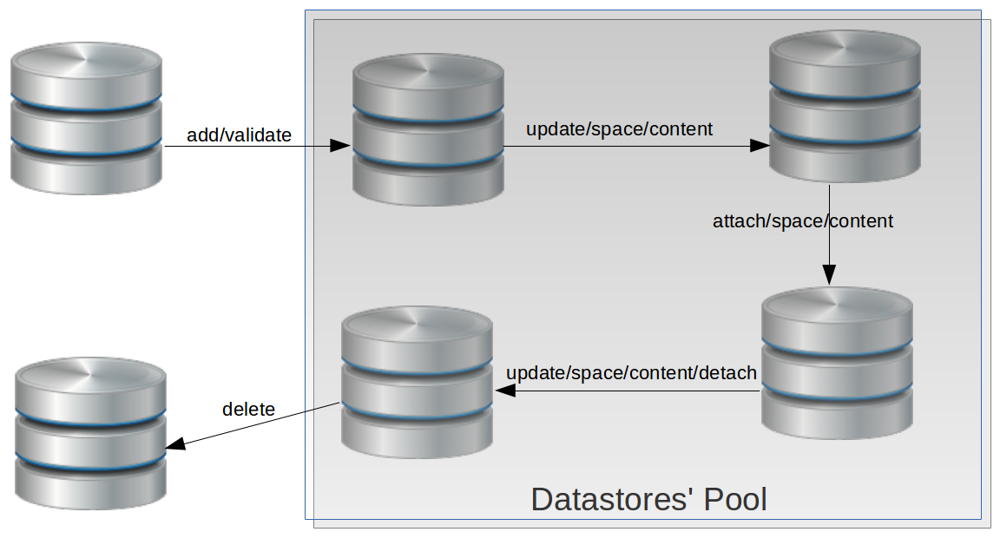

Datastores
==========

Understandig what is a Datastores' pool, how to use it and what is a datastore?
-------------------------------------------------------------------------------

What is the datastores' pool and how to use it
^^^^^^^^^^^^^^^^^^^^^^^^^^^^^^^^^^^^^^^^^^^^^^

Basically the datastores' pool allows to **provision some network attached storage into the zones** to be used at the moment to store **volumes/instances/images resources** in a zone. **Just can be used a datastore per zone and resource**. Initially has been implemented through GLUSTERFS (network/cluster filesystem), also with NFS (Network File System); but this component will be extent.

Once a datastore is **discovered** it can be added to the datastores' pool and forward perfom operations as knows its **space**, **content** and **link** it to a specific zone and resource (attach), also allow to **unlink** it from the zone and resource (detach). It's important to highlight that a datastore can be updated if it just has not been attached to a zone, otherwise it won't be updated.

If a datastore has not any sense keeping it in the datastores' pool, it can be **delete** as well.

What is a datastore?
^^^^^^^^^^^^^^^^^^^^

A **shared storage resource over a network** in a server identified by its endpoint, store, type of implementation and others who it is a candidate to take part in an OpenStack Zone. A datastore is view in the datastores' pool once it has been added to.

How to use the datastore information once it has been attached to a zone (Reference its properties to be used in a zone)
------------------------------------------------------------------------------------------------------------------------

To do a reference about a specific datastore property and use it (once it has been attached to a zone) just you need to do $zone.id.property. For further information http://docs.stackops.org/display/STACKOPSAUTOMATION/Properties

Life cycle management basics
----------------------------

The datastores' pool is the tool included in StackOps Automation that automates this whole process. This chart shows the life cycle (described below) a datastore can have in the tool:

Managing Datastores
-------------------

The operations allowed in the python-automatioclient are

.. code-block:: bash

   datastore-discovery
                       Discovery endpoints from NFS.
   datastore-validate  Validate a discovered NFS endpoint or just a GLUSTER
                       endpoint.
   datastore-add       Validate and add to the pool a NFS endpoint or GLUSTER
                       endpoint.
   datastore-list      List a pool of datastores.
   datastore-show      Show details about a datastore.
   datastore-content   List top content (first level) of a specific
                       datastore.
   datastore-space     Show the space of a specific datastore.
   datastore-update    Update parameters of a specific datastore.
   datastore-attach    Attach a specific datastore to a zone.
   datastore-detach    Detach a specific datastore from a zone.
   datastore-delete    Delete specific datastore.

Discovery a datastore
^^^^^^^^^^^^^^^^^^^^^

The discovery service is to discover the differents -network file systems- (datastores) over a network. Must be specified an endpoint mandatorily.

.. code-block:: bash

   $ automation help datastore-discovery 
   usage: automation datastore-discovery <endpoint>

   Discovery endpoints from NFS.

   Positional arguments:
   <endpoint>  NFS endpoint to discovery

   $ datastore-discovery 192.168.1.52
   +------------+-------------+
   |   store    |   allowed   |
   +------------+-------------+
   | /mnt/ada42 | 192.168.1.0 |
   | /mnt/ada54 | 192.168.1.0 |
   +------------+-------------+

Validate a datastore
^^^^^^^^^^^^^^^^^^^^

The validate service is a process to check if the datastore candidate to be added to the pool has the enough permissions, also to check if automation has the necesaries users/groups to operate over it.

.. code-block:: bash

   $ help datastore-validate
   usage: automation datastore-validate <storage_type> <endpoint> <datastore>
                                        <identifier>

   Validate a discovered NFS endpoint or just a GLUSTER endpoint.

   Positional arguments:
     <storage_type>  Can be NFS or GLUSTER
     <endpoint>      NFS or GLUSTER endpoint to validate
     <datastore>     datastore/store/volume to validate
     <identifier>    Some identifier to operate with the datastore/store/volume

   $ datastore-validate NFS 192.168.1.52 /mnt/ada42 nfs1
   +------------------------+-----------------------------------------------+
   |        Property        |                     Value                     |
   +------------------------+-----------------------------------------------+
   |        endpoint        |                  192.168.1.52                 |
   |       identifier       |                      nfs1                     |
   |        message         |     Datastore nfs1 validated successfully.    |
   |      storage_type      |                      NFS                      |
   |         store          |                   /mnt/ada42                  |
   | test_drwx_with_content |                       [                       |
   |                        |                    "file_test",               |
   |                        |           "test_datastorage_from_nfs1",       |
   |                        |     "test_datastorage_from_nfs1_user_glance", |
   |                        |       "test_datastorage_from_nfs1_user_nova"  |
   |                        |                       ]                       |
   +------------------------+-----------------------------------------------+ 

Add a datastore to the pool
^^^^^^^^^^^^^^^^^^^^^^^^^^^

The add service validates and persist to the pool the datastore candidate.

.. code-block:: bash

   $ help datastore-add
   usage: automation datastore-add [--parameters <parameters>]
                                   <storage_type> <endpoint> <datastore>
                                   <identifier>

   Validate and add to the pool a NFS endpoint or GLUSTER endpoint.

   Positional arguments:
     <storage_type>        Can be NFS or GLUSTER
     <endpoint>            NFS or GLUSTER endpoint to add
     <datastore>           datastore/store/volume to add in the pool
     <identifier>          Some identifier to operate with the
                           datastore/store/volume

   Optional arguments:
     --parameters <parameters>
                           Parameters to define the new datastore/store/volume in
                           the pool, each parameter must be separate by a comma.
                           Ex. 1,3,5
   
   $ datastore-add NFS 192.168.1.52 /mnt/ada42 nfs1
   +------------------------+-----------------------------------------------------------------+
   |        Property        |                              Value                              |
   +------------------------+-----------------------------------------------------------------+
   |        endpoint        |                           192.168.1.52                          |
   |       identifier       |                               nfs1                              |
   |        message         | Datastore nfs1 validate and persisted in database successfully. |
   |       parameters       |                                                                 |
   |      storage_type      |                               NFS                               |
   |         store          |                            /mnt/ada42                           |
   | test_drwx_with_content |                                [                                |
   |                        |                             "file_test",                        |
   |                        |                    "test_datastorage_from_nfs1",                |
   |                        |              "test_datastorage_from_nfs1_user_glance",          |
   |                        |                "test_datastorage_from_nfs1_user_nova"           |
   |                        |                                ]                                |
   +------------------------+-----------------------------------------------------------------+

List datastores from pool
^^^^^^^^^^^^^^^^^^^^^^^^^

.. code-block:: bash

   $ datastore-list
   +----+------------+------------------+--------------+------------+-----------+---------------+
   | id | identifier | id_storage_types |   endpoint   |   store    |   status  | resource_type |
   +----+------------+------------------+--------------+------------+-----------+---------------+
   | 13 |    lis     |       NFS        | 192.168.1.52 | /mnt/ada54 | AVAILABLE |   UNASSIGNED  |
   | 14 |    nfs1    |       NFS        | 192.168.1.52 | /mnt/ada42 | AVAILABLE |   UNASSIGNED  |
   | 7  | glusterfs  |     GLUSTER      | 192.168.1.58 |  testvol   | AVAILABLE |   INSTANCES   |
   | 8  | glusterfs1 |     GLUSTER      | 192.168.1.59 |  /testvol  | AVAILABLE |   UNASSIGNED  |
   +----+------------+------------------+--------------+------------+-----------+---------------+

Show a specific datastore
^^^^^^^^^^^^^^^^^^^^^^^^^

Show all the information related with a specific datastore.

.. code-block:: bash
 
   $ datastore-show 14
   +-----------------------+----------------------------------------+
   |     Property          |                 Value                  |
   +-----------------------+----------------------------------------+
   |     endpoint          |              192.168.1.52              |
   |       href            | http://0.0.0.0:8089/v1.1/datastores/14 |
   |        id             |                   14                   |
   |   id_nova_zone        |                  None                  |
   |  id_storage_types     |                  NFS                   |
   |    identifier         |                  nfs1                  |
   |    parameters         |                                        |
   |  resource_type        |               UNASSIGNED               |
   |      status           |               AVAILABLE                |
   |      store            |               /mnt/ada42               |
   |    updated_at         |                  None                  |
   +-----------------------+----------------------------------------+

Show the content of a specific datastore
^^^^^^^^^^^^^^^^^^^^^^^^^^^^^^^^^^^^^^^^

Show the first level content of a specific datastore.

.. code-block:: bash

   $ datastore-content 14
   +----------+-----------+
   | Property |   Value   |
   +----------+-----------+
   |   file   | file_test |
   +----------+-----------+

Show the space resume of a specific datasore
^^^^^^^^^^^^^^^^^^^^^^^^^^^^^^^^^^^^^^^^^^^^

Show the total space, available space, used space an others about a specific datastore.

.. code-block:: bash

   $ datastore-space 14
   +------------+-------------------------+
   |  Property  |          Value          |
   +------------+-------------------------+
   |   Avail    |           1.8G          |
   | Filesystem | 192.168.1.52:/mnt/ada42 |
   |  Mounted   |        /mnt/nfs1        |
   |    Size    |           1.9G          |
   |    Use     |            1%           |
   |    Used    |           8.0K          |
   +------------+-------------------------+

Update a specific datastore
^^^^^^^^^^^^^^^^^^^^^^^^^^^

Update a specific datastore parameters

.. code-block:: bash

   $  help datastore-update
   usage: automation datastore-update <datastore-id> <parameters>

   Update parameters of a specific datastore.

   Positional arguments:
     <datastore-id>  ID of the datastore/store/volume in the pool
     <parameters>    Parameters to define the new datastore/store/volume in the
                     pool, each parameter must be separate by a comma. Ex. 1,3,5

   $ datastore-update 14 par1,par2,par3
   +------------------+----------------------------------------+
   |     Property     |                 Value                  |
   +------------------+----------------------------------------+
   |     endpoint     |              192.168.1.52              |
   |       href       | http://0.0.0.0:8089/v1.1/datastores/14 |
   |        id        |                   14                   |
   |   id_nova_zone   |                  None                  |
   | id_storage_types |                  NFS                   |
   |    identifier    |                  nfs1                  |
   |    parameters    |             par1 par2 par3             |
   |  resource_type   |               UNASSIGNED               |
   |      status      |               AVAILABLE                |
   |      store       |               /mnt/ada42               |
   |    updated_at    |          2013-12-04 12:38:01           |
   +------------------+----------------------------------------+

Attach a specific datastore to a zone
^^^^^^^^^^^^^^^^^^^^^^^^^^^^^^^^^^^^^

This service allows to link a specific datastore to a zone and resource (volumes/instances/images), it's mandatory to specified the zone, role and component-name whom keep the properties to match this datastore with the zone.

**Be aware:** The **--secure parameter** will not allow detach a datastore from a zone, even if it is performing the detach operation with the **--force parameter**.

.. code-block:: bash

   $ help datastore-attach
   usage: automation datastore-attach [--secure <secure>]
                                   <datastore-id> <zone> <resource>

   Attach a specific datastore to a zone.

   Positional arguments:
     <datastore-id>     ID of the datastore/store/volume in the pool
     <zone>             ID of the zone to attach the resource
     <resource>         Indicates the kind of the resource will be used. Images,
                        instances or volumes

   Optional arguments:
     --secure <secure>  Indicates whether the datastore/store/volume in the pool
                        won't be detached.

   $ datastore-attach 14 2 images
   +------------------+----------------------------------------+
   |     Property     |                 Value                  |
   +------------------+----------------------------------------+
   |     endpoint     |              192.168.1.52              |
   |       href       | http://0.0.0.0:8089/v1.1/datastores/14 |
   |        id        |                   14                   |
   |   id_nova_zone   |                   2                    |
   | id_storage_types |                  NFS                   |
   |    identifier    |                  nfs1                  |
   |    parameters    |             par1 par2 par3             |
   |  resource_type   |                 IMAGES                 |
   |      status      |               AVAILABLE                |
   |      store       |               /mnt/ada42               |
   |    updated_at    |          2013-12-04 12:54:03           |
   +------------------+----------------------------------------+

Detach a specific datastore from a zone
^^^^^^^^^^^^^^^^^^^^^^^^^^^^^^^^^^^^^^^

This service allows to unlink a specific datastore from a zone and resource (volumes/instances/images).

**Be aware:** Performing the detach operation with the **--force parameter** does not take into account of the datastore is being used or not. It's just deleted.

.. code-block:: bash

   $ help datastore-detach
   usage: automation datastore-detach [--force <force>] <datastore-id>

   Detach a specific datastore from a zone.

   Positional arguments:
     <datastore-id>   ID of the datastore/store/volume in the pool

   Optional arguments:
     --force <force>  Indicates whether the datastore/store/volume in the pool
                      will be detached perforce. Type the word 'force' to force
                      the operation
 
   $ datastore-detach 14 --force force
   +------------------+----------------------------------------+
   |     Property     |                 Value                  |
   +------------------+----------------------------------------+
   |     endpoint     |              192.168.1.52              |
   |       href       | http://0.0.0.0:8089/v1.1/datastores/14 |
   |        id        |                   14                   |
   |   id_nova_zone   |                  None                  |
   | id_storage_types |                  NFS                   |
   |    identifier    |                  nfs1                  |
   |    parameters    |                defaults                |
   |  resource_type   |               UNASSIGNED               |
   |      status      |               AVAILABLE                |
   |      store       |               /mnt/ada42               |
   |    updated_at    |          2013-12-04 13:01:56           |
   +------------------+----------------------------------------+

Delete a datastore from pool
^^^^^^^^^^^^^^^^^^^^^^^^^^^^

Deletes a specific datastore from pool

.. code-block:: bash
   
   $ datastore-delete 14
